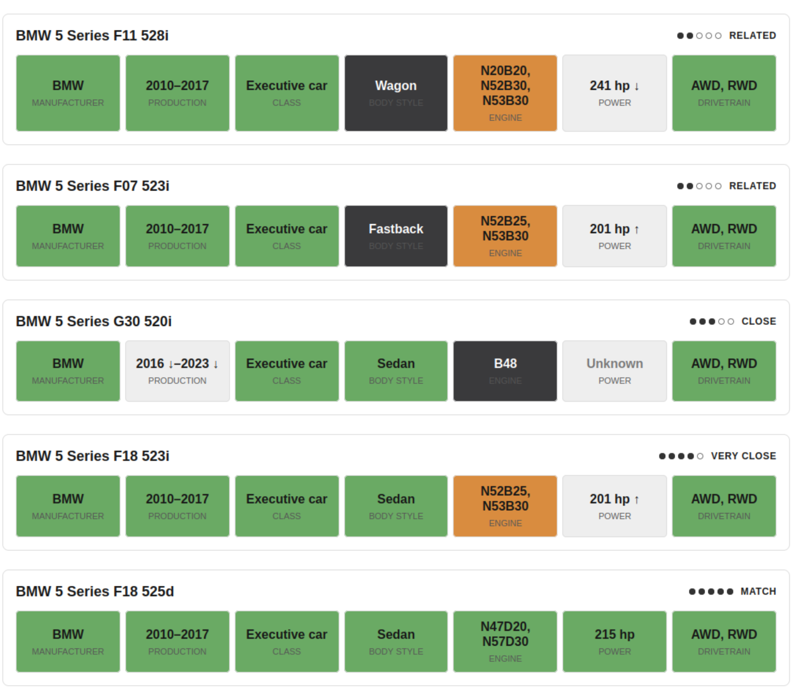
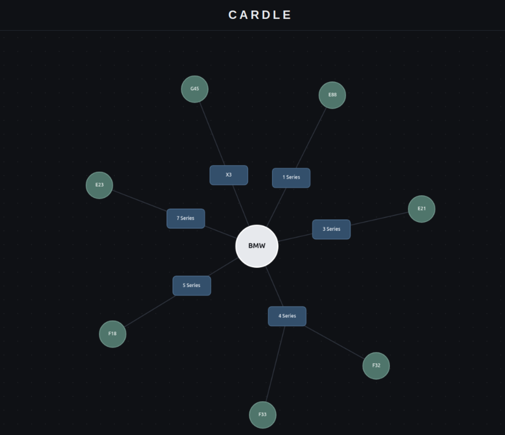
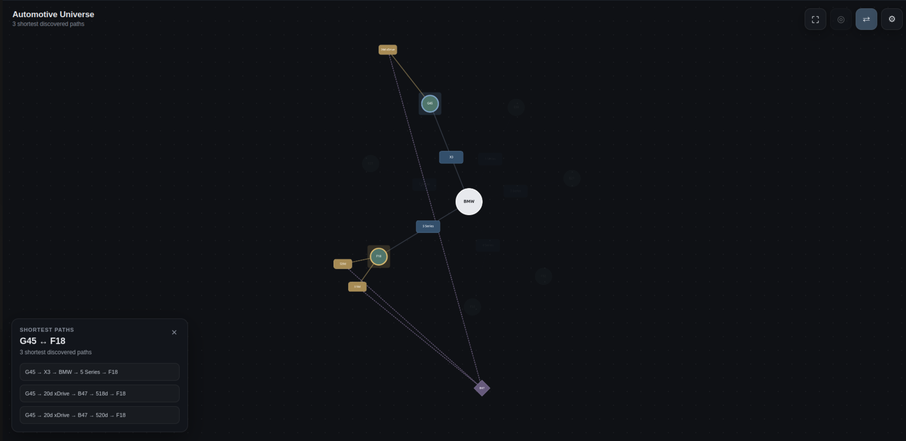

# Cardle [(Click to play)](https://cardle-pi.vercel.app/)   
 


Cardle is a daily car-guessing game built around an automotive knowledge graph. Inspired by Wordle, it challenges players to identify one vehicle each day using structured feedback about its properties and relationships.

Every correctly identified vehicle is added to a persistent, interactive visualization called the **Automotive Universe**. As the collection grows, relationships involving manufacturers, models, variants, engines, vehicle lineage, body styles, and drivetrains gradually reveal the structure of the automotive domain.

The project is also an exploration of a broader knowledge-engineering problem: how can inconsistent, semi-structured automotive information be extracted, canonicalized, represented as a property graph, and used by an application?

## Key features

- One deterministic vehicle to identify each day, with a maximum of seven guesses
- Structured feedback for manufacturer, production years, vehicle class, body style, engine, power, drivetrain, and overall graph proximity
- Hierarchical engine comparison at engine-series, engine-family, and exact-engine levels
- Support for predecessor and successor relationships between vehicle generations
- Persistent daily progress without requiring user accounts
- An unlockable, interactive Automotive Universe built with Cytoscape.js
- A graph-backed FastAPI service rather than a static vehicle catalogue

## From source data to application

> **Wikipedia** → **Raw extraction JSON** → **Canonicalization** →
> **Canonical JSON** → **Neo4j property graph** → **FastAPI** →
> **React application**


Cardle separates the pipeline into distinct layers so that uncertainty and source-specific formatting do not leak directly into the database or game logic.

1. **Extraction** collects the available facts from Wikipedia infoboxes, specification tables, page sections, and links. The raw representation preserves source-level information.
2. **Canonicalization** resolves identifiers, normalizes terminology and values, assigns versions to the correct variants, deduplicates reusable entities, and resolves relationships where the evidence is sufficient.
3. **Validation** checks collection structure, identifier uniqueness, and references between canonical entities.
4. **Graph import** reconstructs the database from canonical JSON using idempotent, batched Cypher queries.
5. **Application repositories** query Neo4j and assemble graph data into objects used by the game and Automotive Universe.

The canonical JSON is therefore the reproducible source of truth for the application graph; the Neo4j database can be rebuilt from it.

## Knowledge graph

### Domain model

The main vehicle hierarchy distinguishes between concepts that are often conflated in automotive datasets:

| From | Relationship | To |
|---|---|---|
| Manufacturer | `PRODUCES` | Model |
| Model | `HAS_VARIANT` | Variant |
| Variant | `HAS_VERSION` | Version |
| Variant | `SUCCEEDED_BY` | Variant |
| Variant | `DESIGNED_BY` | Designer |
| Variant | `HAS_BODY_STYLE` | BodyStyle |
| Variant | `HAS_CLASS` | VehicleClass |
| Variant | `HAS_DRIVETRAIN` | Drivetrain |

- A **Manufacturer** represents a marque, such as BMW.
- A **Model** represents a marketed model line, such as the 3 Series.
- A **Variant** represents a generation or chassis, such as E36 or G20.
- A **Version** represents a marketed configuration, such as 325i or 330d xDrive.

- A **Manufacturer** represents a marque, such as BMW.
- A **Model** represents a marketed model line, such as the 3 Series.
- A **Variant** represents a generation or chassis, such as E36 or G20.
- A **Version** represents a marketed configuration, such as 325i or 330d xDrive.

The explicit Variant layer makes it possible to represent production periods, designers, body styles, classes, drivetrains, and model succession at the generation where those facts apply. A canonical `No Model` placeholder handles vehicles that do not belong to a meaningful model line; the application hides this implementation detail from players.

### Engine hierarchy

Engine identity is represented at three levels:

| From | Relationship | To | Example |
|---|---|---|---|
| Manufacturer | `HAS_ENGINE_SERIES` | EngineSeries | B |
| EngineSeries | `HAS_ENGINE_FAMILY` | EngineFamily | B48 |
| EngineFamily | `HAS_ENGINE` | Engine | B48B20O1 |
| Version | `USES_ENGINE` | Engine | Exact code known |
| Version | `USES_ENGINE_FAMILY` | EngineFamily | Only family known |

This distinction prevents a broad engine family such as `B48` from being treated as equivalent to a specific code such as `B48B20O1`. When Wikipedia supports only a family-level assertion, Cardle links the Version directly to the EngineFamily instead of inventing a more precise Engine node.

Properties that describe a particular use of an engine—displacement, cylinder count, and arrangement—are stored on the `USES_ENGINE` or `USES_ENGINE_FAMILY` relationship. This preserves the reusable identity of the engine while allowing usage-specific facts to belong to the connection.

The hierarchy also drives the game feedback:

| Deepest shared engine identity | Feedback |
|---|---|
| Exact Engine | Green |
| EngineFamily | Yellow |
| EngineSeries | Orange |
| No shared level | Black |
| Insufficient source data | Unknown |

### Why Neo4j?

Automotive entities are connected through more than a single hierarchy. Two vehicles may share an engine family or designer, belong to adjacent generations, or connect through a mixture of lineage and component relationships. A property graph makes these connections explicit and directly traversable.

Neo4j was selected after initial RDF/SHACL and handwritten property-graph prototypes. RDF remains valuable for semantic interoperability, but the Neo4j property-graph model was chosen for the playable application because Cypher provides a concise way to reconstruct vehicles, traverse lineage, query shared entities, and return subgraphs for interactive visualization.



## Neo4j implementation

The importer in `src/cardle/graph/neo4j_importer.py` performs the following operations:

- verifies database connectivity;
- checks that all expected canonical collections exist;
- creates uniqueness constraints for all twelve node types;
- imports nodes in batches using `UNWIND` and `MERGE`;
- creates the vehicle and engine hierarchies;
- links variants to reusable classes, body styles, engine positions, drivetrains, and designers;
- resolves predecessor and successor records into `SUCCEEDED_BY` edges;
- separates exact-engine usage from family-only usage; and
- attaches usage-specific properties to engine relationships.

Stable canonical IDs and `MERGE`-based Cypher make repeated imports idempotent. Batching keeps the importer suitable for datasets larger than the first BMW prototype.

The application does not expose Neo4j directly to the browser. Read-only repository classes contain the Cypher needed by each application use case:

- `Neo4jVehicleRepository` reconstructs either a Version-level vehicle or a Variant with no Versions, including its reusable attributes, engine ancestry, and lineage neighbours.
- `Neo4jUniverseRepository` converts discovered vehicle IDs into unlocked Variants and returns a deduplicated subgraph for visualization.

This repository boundary keeps database queries separate from comparison rules, HTTP serialization, and presentation code.

## Graph-powered game logic

The feedback system uses both property values and graph relationships.

- Guessing another Version of the same Variant is considered very close.
- Direct predecessor or successor Variants are close.
- Vehicles in the same Model are related.
- Vehicles from the same Manufacturer are farther away.
- Engine feedback traverses from exact Engine to EngineFamily and EngineSeries.
- Set-valued fields distinguish exact set equality, partial overlap, no overlap, and missing information.
- Production years and power return directional feedback when the target value is higher or lower.

The daily target selector sorts vehicles by stable ID and derives an index from the date, producing the same target for every player without storing daily answers. The API reconstructs a saved game from the submitted guess IDs and reveals the target only after the player wins or exhausts all seven guesses.

## Automotive Universe

The Automotive Universe turns game progress into a persistent graph. Correctly identifying any Version unlocks its complete Variant, including all Versions belonging to that generation. This gives the visualization a domain-level meaning rather than showing only disconnected answers.

The backend returns a deduplicated graph projection from Neo4j. The React frontend uses Cytoscape.js to lay out and interact with the resulting manufacturers, models, variants, versions, engine identities, and their edges. Unlock state is stored in the browser, following the same account-free design as daily game persistence.

## Current dataset

The current complete dataset covers BMW and is used as the first end-to-end prototype.

| Entity | Count |
|---|---:|
| Manufacturers | 1 |
| Models | 26 |
| Variants | 125 |
| Versions | 1,059 |
| Engine series | 4 |
| Engine families | 64 |
| Exact engines | 142 |
| Engine usages | 1,280 |
| Body styles | 9 |
| Vehicle classes | 14 |
| Engine positions | 3 |
| Drivetrains | 3 |
| Designers | 73 |

These counts describe the canonical BMW v1.1 dataset committed in `data/canonical/full_bmw_canonical.json`. Toyota Auris data is currently included as an experimental step toward supporting additional manufacturers, but it is not yet part of the complete production dataset.

## Architecture and deployment

| From | Connection | To |
|---|---|---|
| React and Cytoscape.js | HTTPS/JSON API | FastAPI on Render |
| FastAPI | Cypher | Neo4j AuraDB |
| Browser | Daily progress and unlocks | localStorage |

The production application uses:

- **Vercel** for the React/Vite frontend;
- **Render** for the FastAPI backend; and
- **Neo4j AuraDB** for the hosted property graph.

No account is required. Shared automotive knowledge lives in Neo4j, while the current date, guess IDs, and discovered vehicle IDs are stored locally in the player's browser.

## Technology stack

| Layer | Technologies |
|---|---|
| Data extraction and integration | Python, Requests, custom Wikipedia parsers |
| Canonical representation | JSON, stable IDs, custom validation |
| Knowledge graph | Neo4j, Cypher |
| Backend | FastAPI, Pydantic, Neo4j Python driver |
| Frontend | React, TypeScript, Vite |
| Graph visualization | Cytoscape.js |
| Testing | pytest, frontend linting and production builds |
| Deployment | Neo4j AuraDB, Render, Vercel |

## Repository structure

```text
data/
  raw/                    Extracted, source-oriented JSON
  canonical/              Normalized and validated graph input
docs/
  schema.md               Canonical schema specification
  dev-log.md              Design decisions and development history
prototype/
  rdf/                    RDF ontology and SHACL experiment
  initial_neo4j/          Handwritten property-graph prototype
src/cardle/
  extract/                Wikipedia discovery and extraction
  canonical/              Normalization, entity resolution, and validation
  graph/                  Neo4j importer
  game/                   Repositories, comparison rules, and sessions
  universe/               Automotive Universe graph projection
  web/                    FastAPI routes and schemas
frontend/                 React/TypeScript application
tests/                    Backend unit tests
```

## Running locally

### Requirements

- Python 3.14 or newer
- Node.js and npm
- A running Neo4j database

### Backend and database

Create a virtual environment and install the project:

```bash
python -m venv .venv
source .venv/bin/activate
pip install -e ".[dev]"
```

Configure the Neo4j connection:

```bash
export NEO4J_URI="neo4j://localhost:7687"
export NEO4J_USERNAME="neo4j"
export NEO4J_PASSWORD="your-password"
export NEO4J_DATABASE="neo4j"
```

Import the canonical BMW dataset:

```bash
python -m cardle.graph.neo4j_importer \
  data/canonical/full_bmw_canonical.json
```

Start the API:

```bash
uvicorn cardle.web.app:app --reload
```

### Frontend

In a second terminal:

```bash
cd frontend
npm install
npm run dev
```

The Vite development server proxies `/api` requests to `http://127.0.0.1:8000`.

### Tests and checks

```bash
pytest

cd frontend
npm run lint
npm run build
```

## Main design challenges

### Inconsistent source structure

Wikipedia vehicle pages vary considerably. Relevant facts may appear in an infobox, a specification table, a section, or a linked page, and different manufacturers organize generations and versions differently. The extractor was therefore developed as a collection of focused parsers rather than as one rigid page template.

### Entity granularity

Choosing the boundary between Model, Variant, and Version was necessary before meaningful canonical IDs or relationships could be created. The selected hierarchy preserves chassis-level facts without collapsing marketed versions into a single vehicle record.

### Canonical identity and deduplication

The same reusable entity can occur across many pages with inconsistent spelling, formatting, or specificity. Canonicalization creates stable manufacturer-scoped IDs and global registries. Conflicting entities with the same ID raise an error instead of being silently overwritten.

### Incomplete knowledge

The graph distinguishes unknown information from negative information. Missing exact engine codes do not result in fabricated Engine nodes, unresolved lineage targets remain unresolved, and the game exposes an explicit unknown feedback state where comparison would otherwise be misleading.

### Generalization beyond BMW

BMW pages are unusually detailed and relatively consistent compared with some manufacturers. The current pipeline proves the complete architecture, but broader coverage will require manufacturer-specific discovery, additional extraction strategies, reconciliation across multiple sources, and potentially constrained language-model assistance for unstructured passages.

## Project evolution

Cardle began with a manually written BMW 6 Series property graph to test entity granularity and useful relationships. An RDF ontology and SHACL shapes were then prototyped to explore semantic validation. For the playable system, the architecture was simplified to a canonical JSON layer followed by validated Neo4j import, while retaining the RDF work as a documented experiment.

The project has since progressed through the complete path from source extraction to a deployed graph-backed web application. The prototype directories and development log preserve the decisions and rejected alternatives rather than presenting the final architecture as inevitable.

## Roadmap

- Improve the Automotive Universe focus mode and large-graph grouping
- Refine mobile graph interaction and navigation
- Add player statistics, streaks, and achievements
- Extend the canonical dataset beyond BMW
- Evaluate multi-source reconciliation and provenance
- Experiment with constrained extraction from unstructured text
- Revisit RDF export and semantic interoperability after broader data integration

## Documentation

- [`docs/schema.md`](docs/schema.md) — detailed canonical schema and engine hierarchy
- [`docs/cardle_game_feedback_spec_v1.md`](docs/cardle_game_feedback_spec_v1.md) — feedback semantics
- [`docs/dev-log.md`](docs/dev-log.md) — chronological development decisions
- [`data/sources.md`](data/sources.md) — evaluated automotive data sources