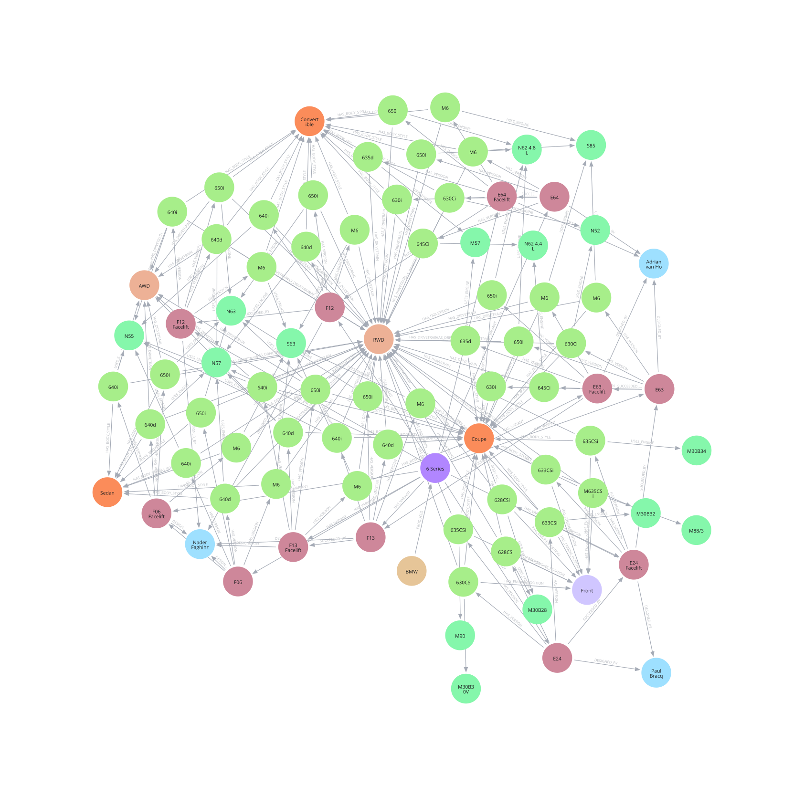
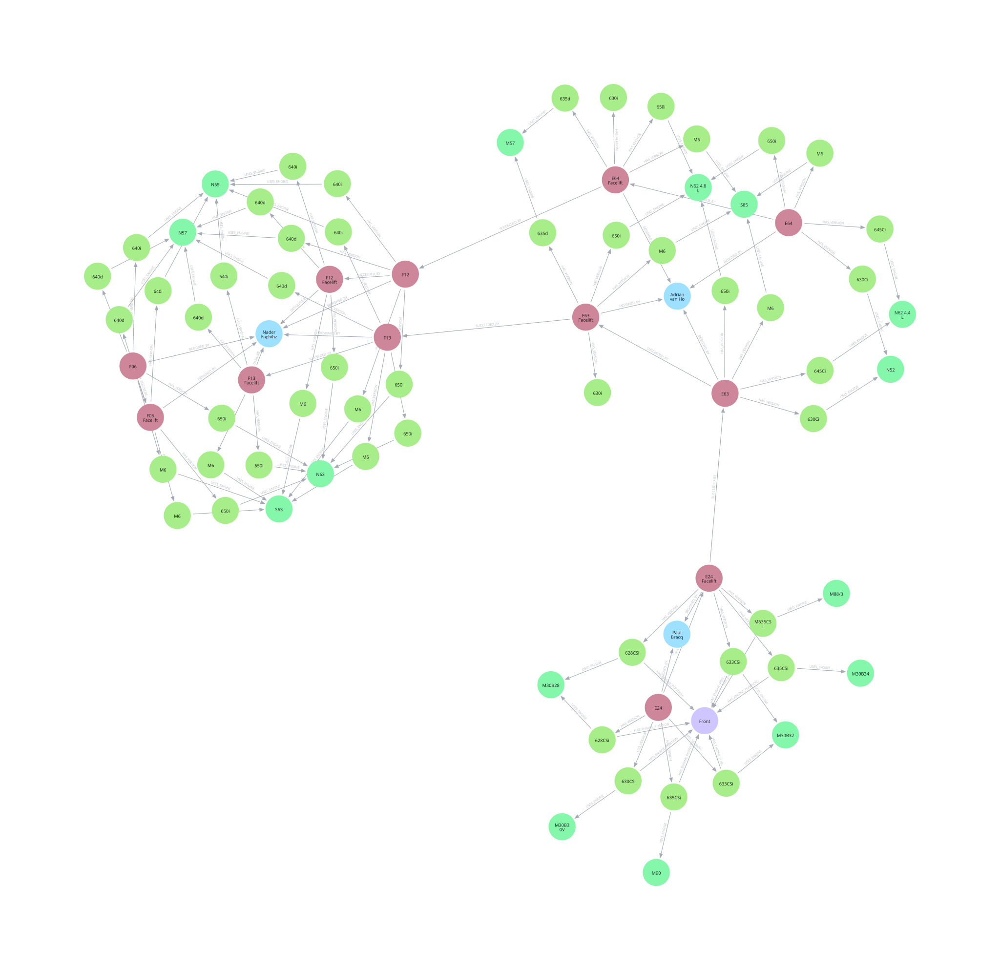

# Manual BMW 6 series graph prototype

This prototype was manually written using information from wikipedia provided about 1st, 2nd and 3rd generation BMW 6 series cars. The goal is to experiment with the automotive property graph schema, identify useful relation ships, what kind of relationships will be showed to the player, and explore how vehicles can become connected through the shared entities.

## The whole graph
```cypher
MATCH (n)-[r]->(m)
RETURN n, r, m
```


As you can see all the bmw car variants "bond" over being rear wheel driven and having similar body styles. This is not really a meaningful relationship that I would show to players as it would clutter the graph too much and wouldn't give new insights. Also, we already know that these cars are all 6 series and made by BMW so that information is redundant as well.

'''cypher
MATCH (n)-[r]->(m)
WHERE NOT type(r) IN ['HAS_DRIVETRAIN', 'HAS_BODY_STYLE', 'PRODUCES', 'HAS_VARIANT']
RETURN n, r, m;
'''


Now it looks way nicer! Three clusters formed by three generations of 6 series connected by succession relationship :)
